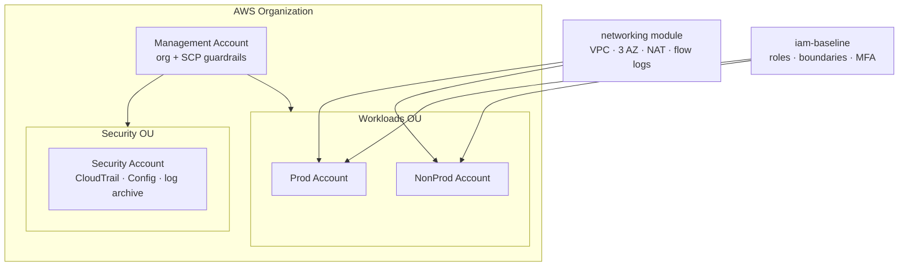

# Secure AWS Landing Zone

[](https://github.com/Corrierethan/secure-aws-landing-zone/actions/workflows/ci.yml)

A multi-account **AWS landing zone** expressed entirely as Terraform — the accredited account,
network, identity, and logging baseline that every federal cloud workload deploys into. Built by
**Ascent DevOps** (Veteran-Owned, SDVOSB) as a reference for the foundation work primes most
often subcontract.

> **Cloud focus:** AWS-first, with **AWS GovCloud (US)** notes throughout. Region and partition
> are variables, so the same code targets commercial or `aws-us-gov`.

---

## Who is this for

A prime contractor wins a federal program and needs a compliant AWS environment stood up before
the first workload team arrives. They subcontract the cloud foundation to a DevSecOps shop —
that shop delivers this landing zone.

**Reach for this when:**

- A new AWS Organization (or GovCloud org) needs a security baseline before any workload is deployed
- A program must demonstrate NIST 800-53 controls (SC-12, SC-28, AU-2, AU-9, AC-6, CM-7) at the infrastructure layer
- The team wants shift-left enforcement: CI runs `terraform fmt`, `terraform validate`, `tflint`, `tfsec`,
  and `checkov` on every PR (HIGH/CRITICAL findings fail the build), plus a non-blocking `terraform plan`
  of the example environments for reviewer visibility
- The environment needs to be reproducible — spun up in a sandbox, torn down, then promoted to prod without manual steps

**Not a fit for:** teams that already have AWS Control Tower deployed and managed by a central
cloud team — this is a Terraform-native alternative, not a wrapper around Control Tower.

---

## What this provides



| Module | Purpose | Key controls (NIST 800-53) |
|---|---|---|
| `remote-state` | S3 + DynamoDB lock + KMS for Terraform state | SC-12, SC-28 |
| `networking` | VPC, 3-AZ public/private subnets, NAT, flow logs | SC-7, AU-12 |
| `iam-baseline` | Least-privilege roles, permission boundaries, MFA | AC-2, AC-6, IA-2 |
| `logging` | Org CloudTrail, AWS Config, versioned/locked S3 archive | AU-2, AU-9, AU-11 |
| `org-guardrails` | SCPs: deny root, region lock, block public S3 | AC-3, CM-7 |

Full crosswalk: [docs/compliance-notes.md](docs/compliance-notes.md).

---

## Module reference

Each module under `modules/` is a self-contained, reusable building block with its own
`variables.tf`, `outputs.tf`, and `README.md`. Environments compose them — the modules never
call each other directly.

### `remote-state`
Bootstraps the Terraform backend itself: a versioned, KMS-encrypted S3 bucket for state, a
DynamoDB table for state locking, and a customer-managed KMS key with key rotation. This is the
one module applied with **local** state first (chicken-and-egg), after which every other config
points its `backend "s3"` block here.
- **Key inputs:** `name_prefix`, `account_id`
- **Key outputs:** `state_bucket_name`, `lock_table_name`, `kms_key_arn`
- **Controls:** SC-12, SC-28, AU-9

### `networking`
A hardened, 3-AZ VPC: public/private subnets per AZ, an internet gateway, NAT gateways (one per
AZ for prod HA or a single shared NAT for cost-saving in non-prod), a deny-all default security
group, and VPC Flow Logs shipped to a KMS-encrypted CloudWatch log group.
- **Key inputs:** `name_prefix`, `vpc_cidr`, `az_count`, `single_nat_gateway`
- **Key outputs:** `vpc_id`, `public_subnet_ids`, `private_subnet_ids`
- **Controls:** SC-7, AU-12, AC-4

### `iam-baseline`
Account-wide identity guardrails: a strong password policy, a reusable permission boundary that
caps what any role can do, and explicit `Deny` statements blocking IAM user / access-key creation
(roles + SSO are preferred over long-lived users).
- **Key inputs:** `name_prefix`, `allowed_actions`
- **Key outputs:** `permission_boundary_arn`
- **Controls:** AC-2, AC-6, IA-2

### `logging`
Centralized audit evidence: a versioned, KMS-encrypted, public-access-blocked S3 log archive
with a lifecycle policy (transition to Glacier, ~7-year retention, abort incomplete uploads).
Designed to be the target for an organization CloudTrail and AWS Config.
- **Key inputs:** `name_prefix`, `account_id`, `log_retention_days`
- **Key outputs:** `log_archive_bucket_name`
- **Controls:** AU-2, AU-9, AU-11

### `org-guardrails`
Preventive Service Control Policies (SCPs) attached to OUs: deny root-user actions, deny activity
outside approved regions (data residency / GovCloud), and block disabling S3 public-access blocks.
Requires AWS Organizations with all features enabled, applied from the management account.
- **Key inputs:** `name_prefix`, `partition`, `approved_regions`, `target_ou_ids`
- **Controls:** AC-3, CM-7

---

## Repository layout

```
secure-aws-landing-zone/
├── modules/                  # reusable building blocks
│   ├── remote-state/
│   ├── networking/
│   ├── iam-baseline/
│   ├── logging/
│   └── org-guardrails/
├── environments/             # compositions that USE the modules
│   ├── management/
│   ├── security/
│   ├── prod/
│   └── nonprod/
├── docs/
│   └── compliance-notes.md
├── .gitlab-ci.yml            # fmt · validate · tflint · tfsec · checkov · plan
├── .tflint.hcl
├── .pre-commit-config.yaml
└── versions.tf               # provider + Terraform version pins
```

---

## Environments

The `environments/` folder holds the compositions that actually call the modules. Each is a
separate Terraform root with its own state key, so blast radius is isolated per account.

| Environment | Purpose | Modules used | State key |
|---|---|---|---|
| `management` | Org root: bootstraps remote state, applies org-wide guardrails | `remote-state`, `org-guardrails` | `management/terraform.tfstate` |
| `security` | Centralized audit account (no workloads) | `logging` | `security/terraform.tfstate` |
| `nonprod` | Example dev/test workload account | `networking`, `iam-baseline`, `logging` | `nonprod/terraform.tfstate` |
| `prod` | Production workload account (HA hardening) | `networking`, `iam-baseline`, `logging` | `prod/terraform.tfstate` |

`nonprod` and `prod` use the same modules with different values — e.g. `nonprod` shares a single
NAT gateway and uses `10.20.0.0/16`, while `prod` runs one NAT per AZ and uses a dedicated,
non-overlapping `10.10.0.0/16`.

---

## Prerequisites

- [Terraform](https://developer.hashicorp.com/terraform/downloads) ≥ 1.6
- AWS credentials for a **sandbox** account (never run untested IaC against prod)
- Optional dev tooling: `tflint`, `tfsec`, `checkov`, `pre-commit`, `terraform-docs`

---

## Deploy from zero

> Start in a throwaway sandbox account. The remote-state bootstrap is the one piece that uses
> local state (chicken-and-egg), then everything else uses the S3 backend.

```bash
# 1. Bootstrap remote state (creates the S3 bucket + DynamoDB lock table)
cd environments/management
terraform init
terraform apply -target=module.remote_state

# 2. Re-init with the S3 backend now that it exists, then apply the rest
terraform init -migrate-state
terraform apply

# 3. Stand up an example workload network
cd ../nonprod
terraform init
terraform apply
```

Each environment folder has its own `README` notes and `terraform.tfvars.example`.

---

## Local development

Run the same checks the CI pipeline runs **before** you push — it's faster than waiting on a
failed PR run.

```bash
# Format every .tf file in place (CI fails on drift)
terraform fmt -recursive

# Validate a single module or environment (no backend/credentials needed)
terraform -chdir=modules/networking init -backend=false
terraform -chdir=modules/networking validate

# Lint with the repo's ruleset
tflint --init
tflint --recursive --config="$(pwd)/.tflint.hcl"

# Security + compliance scans
tfsec . --minimum-severity HIGH
checkov -d . --quiet --framework terraform
```

### pre-commit hooks

Install the hooks once and they run automatically on every `git commit`:

```bash
pip install pre-commit
pre-commit install
pre-commit run --all-files   # run against the whole repo on demand
```

The hooks cover `terraform_fmt`, `terraform_validate`, `tflint`, `tfsec`, `terraform_docs`, plus
secret-detection guards (`detect-aws-credentials`, `detect-private-key`). See
[.pre-commit-config.yaml](.pre-commit-config.yaml).

### Suppressing a Checkov finding

When a finding is a deliberate design choice (e.g. a permission boundary that must use
`Resource = "*"`), suppress it with an **inline comment placed inside the resource block** and a
short justification:

```hcl
resource "aws_iam_policy" "permission_boundary" {
  # checkov:skip=CKV_AWS_290:Boundary is a ceiling, not a grant; roles apply the granular floor.
  ...
}
```

---

## CI/CD

Every pull request runs, in order:

`fmt` → `validate` → `tflint` → `tfsec` → `checkov` → `plan`

The pipeline **fails** on formatting drift, invalid config, lint errors, or HIGH/CRITICAL
security findings. `plan` runs against the example environments on each PR.

> CI runs on **GitHub Actions** ([.github/workflows/ci.yml](.github/workflows/ci.yml)). An
> equivalent **GitLab CI** pipeline ([.gitlab-ci.yml](.gitlab-ci.yml)) is kept in the repo too,
> since federal customers standardize on GitLab — it demonstrates fluency in both.

---

## AWS GovCloud notes

- GovCloud uses `us-gov-west-1` / `us-gov-east-1` and the `aws-us-gov` ARN partition. Both are
  variables (`var.aws_region`, `var.partition`) — nothing is hardcoded.
- Some managed services (e.g. parts of Control Tower) differ in GovCloud. This landing zone uses
  primitives that exist in **both** partitions (Organizations, SCPs, Config, CloudTrail).

---

## Security & compliance highlights

- **Encryption everywhere at rest:** Terraform state, the DynamoDB lock table, the log archive,
  and VPC flow logs are all encrypted with customer-managed KMS keys (rotation enabled).
- **TLS-only state access:** the state bucket policy denies any non-HTTPS request.
- **No long-lived credentials:** IAM user / access-key creation is denied; roles + SSO + OIDC are
  the intended access paths.
- **Preventive guardrails:** SCPs block root usage, out-of-region activity, and public S3.
- **Defense-in-depth networking:** the default security group is emptied (deny-all), and all VPC
  traffic is captured by flow logs for audit (AU-12).
- **Shift-left scanning:** every PR is gated by `tfsec` and `checkov`; HIGH/CRITICAL findings fail
  the build.

Control crosswalk to NIST 800-53: [docs/compliance-notes.md](docs/compliance-notes.md).

---

## Troubleshooting

| Symptom | Likely cause / fix |
|---|---|
| `Error: Backend configuration changed` | You added the `backend "s3"` block before the bucket existed. Apply `-target=module.remote_state` first, then `terraform init -migrate-state`. |
| CI `terraform fmt` job fails | Formatting drift. Run `terraform fmt -recursive` locally and commit. |
| `tflint` errors on a new module | Add a `terraform { required_version, required_providers }` block and ensure every variable has a `description` and `type`. |
| Checkov flags a deliberate design choice | Add an inline `# checkov:skip=CKV_AWS_xxx:reason` **inside** the resource block (not above it). |
| `terraform plan` wants to recreate the state bucket | You're running from the wrong directory or the backend isn't initialized — re-run `terraform init` in the environment folder. |

---

## Status

Active development. See the [GitHub issues](https://github.com/Corrierethan/secure-aws-landing-zone/issues) for the current work breakdown.

## License

MIT — see [LICENSE](LICENSE).
