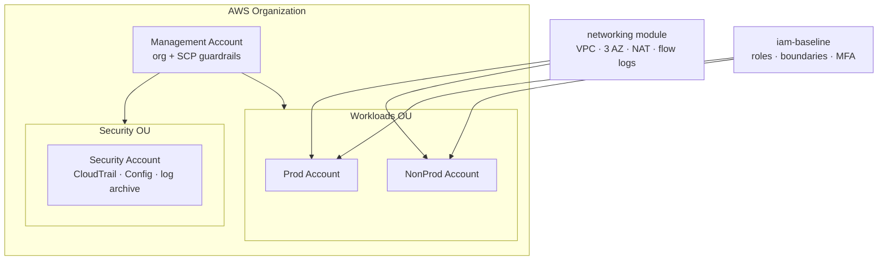

# Secure AWS Landing Zone

[](https://github.com/Corrierethan/secure-aws-landing-zone/actions/workflows/ci.yml)

A multi-account **AWS landing zone** expressed entirely as Terraform — the accredited account,
network, identity, and logging baseline that every federal cloud workload deploys into. Built by
**Ascent DevOps** (Veteran-Owned, SDVOSB) as a reference for the foundation work primes most
often subcontract.

> **Cloud focus:** AWS-first, with **AWS GovCloud (US)** notes throughout. Region and partition
> are variables, so the same code targets commercial or `aws-us-gov`.

---

## What this provides



| Module | Purpose | Key controls (NIST 800-53) |
|---|---|---|
| `remote-state` | S3 + DynamoDB lock + KMS for Terraform state | SC-12, SC-28 |
| `networking` | VPC, 3-AZ public/private subnets, NAT, flow logs | SC-7, AU-12 |
| `iam-baseline` | Least-privilege roles, permission boundaries, MFA | AC-2, AC-6, IA-2 |
| `logging` | Org CloudTrail, AWS Config, versioned/locked S3 archive | AU-2, AU-9, AU-11 |
| `org-guardrails` | SCPs: deny root, region lock, block public S3 | AC-3, CM-7 |

Full crosswalk: [docs/compliance-notes.md](docs/compliance-notes.md).

---

## Repository layout

```
secure-aws-landing-zone/
├── modules/                  # reusable building blocks
│   ├── remote-state/
│   ├── networking/
│   ├── iam-baseline/
│   ├── logging/
│   └── org-guardrails/
├── environments/             # compositions that USE the modules
│   ├── management/
│   ├── security/
│   ├── prod/
│   └── nonprod/
├── docs/
│   └── compliance-notes.md
├── .gitlab-ci.yml            # fmt · validate · tflint · tfsec · checkov · plan
├── .tflint.hcl
├── .pre-commit-config.yaml
└── versions.tf               # provider + Terraform version pins
```

---

## Prerequisites

- [Terraform](https://developer.hashicorp.com/terraform/downloads) ≥ 1.6
- AWS credentials for a **sandbox** account (never run untested IaC against prod)
- Optional dev tooling: `tflint`, `tfsec`, `checkov`, `pre-commit`, `terraform-docs`

---

## Deploy from zero

> Start in a throwaway sandbox account. The remote-state bootstrap is the one piece that uses
> local state (chicken-and-egg), then everything else uses the S3 backend.

```bash
# 1. Bootstrap remote state (creates the S3 bucket + DynamoDB lock table)
cd environments/management
terraform init
terraform apply -target=module.remote_state

# 2. Re-init with the S3 backend now that it exists, then apply the rest
terraform init -migrate-state
terraform apply

# 3. Stand up an example workload network
cd ../nonprod
terraform init
terraform apply
```

Each environment folder has its own `README` notes and `terraform.tfvars.example`.

---

## CI/CD

Every pull request runs, in order:

`fmt` → `validate` → `tflint` → `tfsec` → `checkov` → `plan`

The pipeline **fails** on formatting drift, invalid config, lint errors, or HIGH/CRITICAL
security findings. `plan` runs against the example environments on each PR.

> CI runs on **GitHub Actions** ([.github/workflows/ci.yml](.github/workflows/ci.yml)). An
> equivalent **GitLab CI** pipeline ([.gitlab-ci.yml](.gitlab-ci.yml)) is kept in the repo too,
> since federal customers standardize on GitLab — it demonstrates fluency in both.

---

## AWS GovCloud notes

- GovCloud uses `us-gov-west-1` / `us-gov-east-1` and the `aws-us-gov` ARN partition. Both are
  variables (`var.aws_region`, `var.partition`) — nothing is hardcoded.
- Some managed services (e.g. parts of Control Tower) differ in GovCloud. This landing zone uses
  primitives that exist in **both** partitions (Organizations, SCPs, Config, CloudTrail).

---

## Status

Foundation project of the [Ascent DevOps portfolio](https://github.com/Corrierethan). See the
[ticket backlog](https://github.com/Corrierethan/ascent-portfolio-plan/blob/main/tickets/backlog.md)
(Epic 1) for the work breakdown.

## License

MIT — see [LICENSE](LICENSE).
